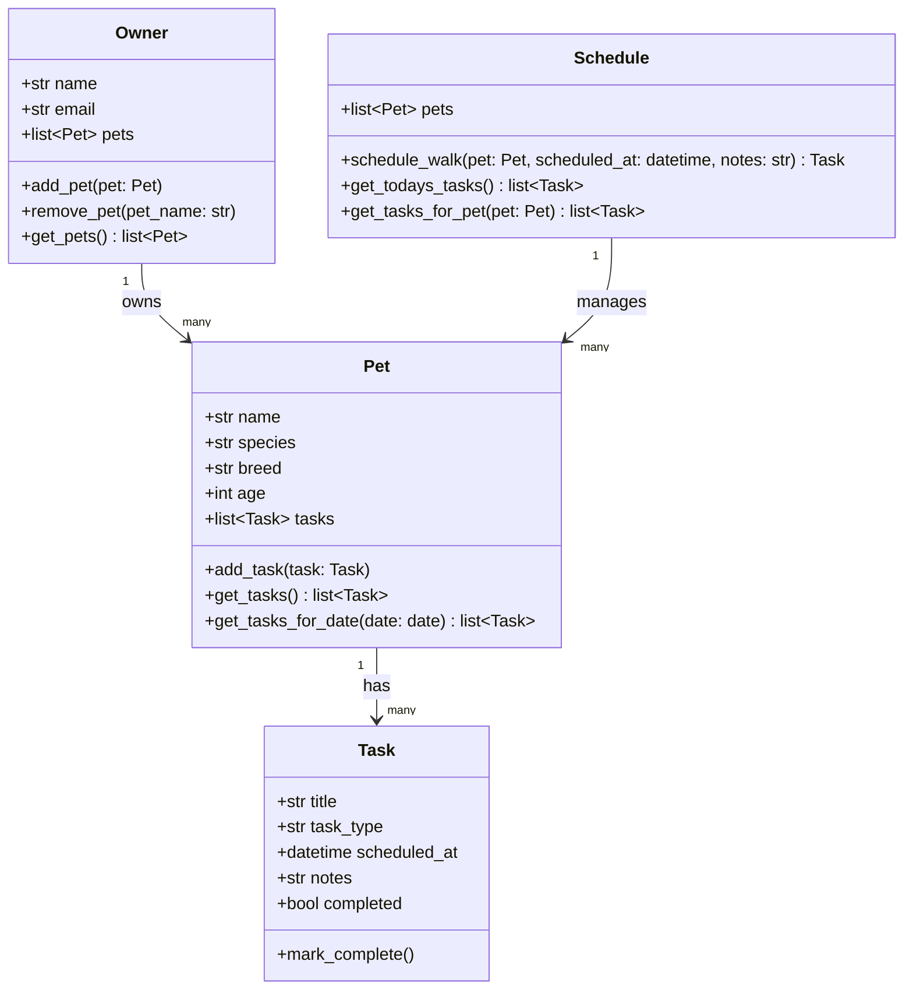

# PawPal+ Reflection

## System Design

### Three Core User Actions

1. **Add a pet** — A user can register a new pet by providing its name, species, breed, and age. The pet is associated with their owner profile.
2. **Schedule a walk** — A user can create a walk task for a specific pet at a chosen date and time, optionally adding notes (e.g., "avoid the dog park on Tuesdays").
3. **See today's tasks** — A user can view all tasks (walks, feedings, vet visits) scheduled for the current day across all their pets.

---

## 1a. Initial Design

The system is organized around four classes:

- **Owner** — Represents the human user of the app. Holds personal info and a list of their pets. Responsible for adding/removing pets and retrieving the full pet roster.
- **Pet** — Represents a single animal. Holds attributes like name, species, breed, and age. Owns a list of tasks and can add or retrieve them.
- **Task** (dataclass) — A lightweight data container representing a single to-do item (walk, feeding, vet visit). Holds the task type, scheduled datetime, notes, and completion status.
- **Schedule** — Acts as a coordinator/manager layer. Knows about all pets and their tasks. Responsible for querying tasks by date (e.g., today's tasks) and scheduling new walks.

**Relationships:**
- An `Owner` *has many* `Pet` objects.
- A `Pet` *has many* `Task` objects.
- A `Schedule` *aggregates* `Pet` objects to provide cross-pet views.

---

## 1b. Design Changes

*(Fill in after AI review — document what you changed and why.)*

---

## Mermaid Class Diagram

